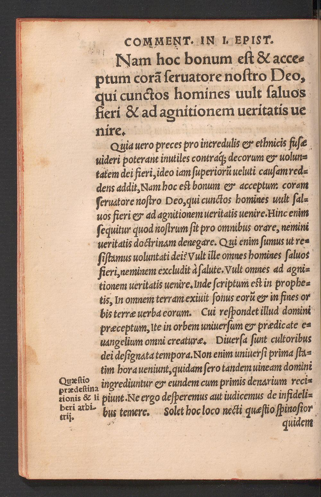
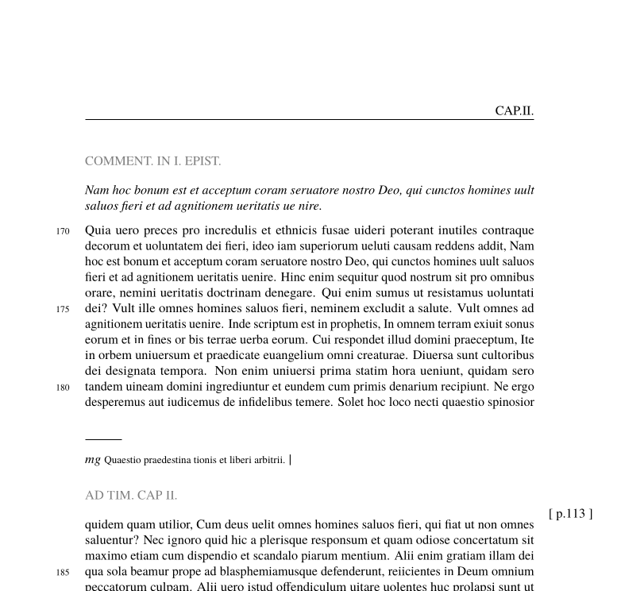
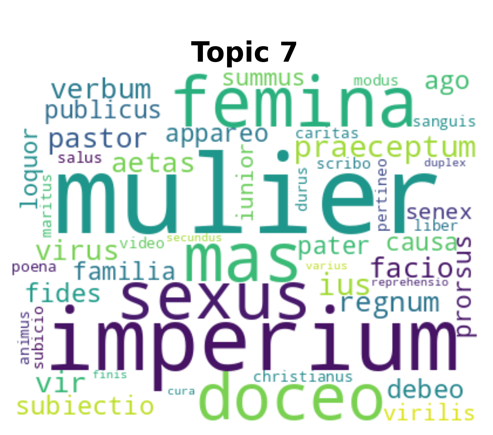
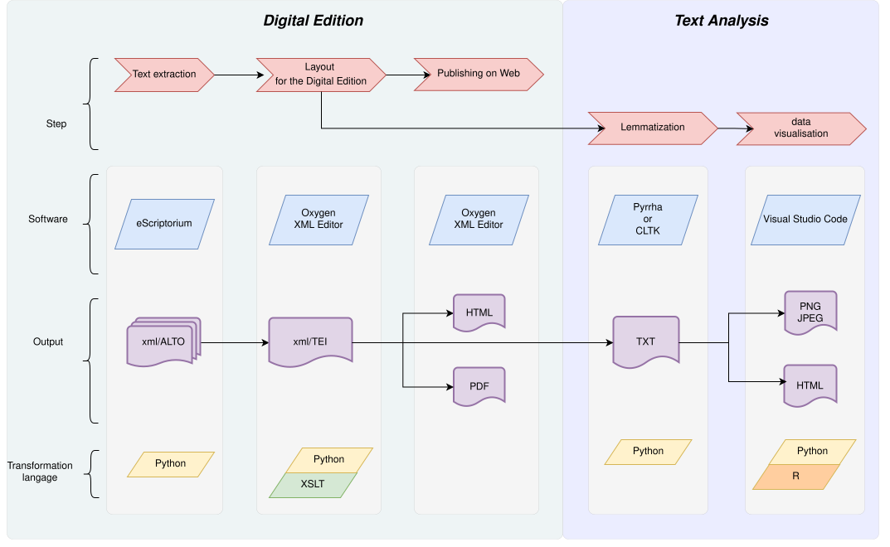
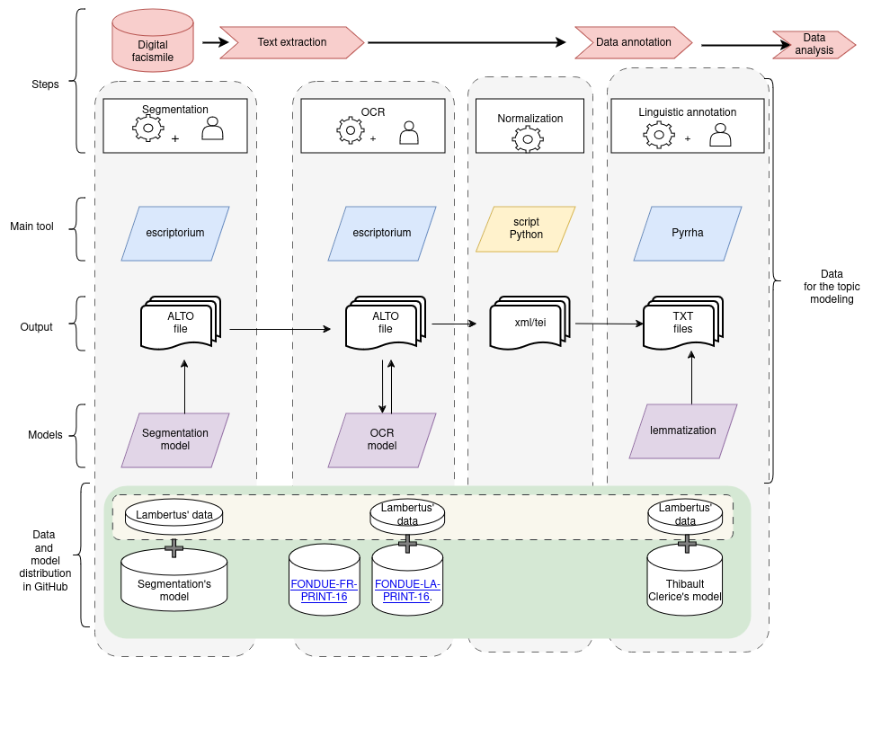

## 16th Century Digital Library : Digital Editing Pipeline

This repository documents the **digital editing pipeline** developed for a **16th-century digital library** project. The pipeline describes the full workflow from **printed page images** to **XML/TEI editions**, and finally to **distant reading and computational analysis**

### Process Overview

| Step | Illustration | Description |
|------|--------------|-------------|
| 1    |  | Original digitized image → image preprocessing |
| 2    |  | Normalized image → analytical processing (topic modeling) |
| 3    |  | Topic *mulier* word cloud [Lambert Daneau commentary](https://www.e-rara.ch/gep_g/doi/10.3931/e-rara-6338) |


The documentation is intended to be **extended and refined over time**. Current sections provide a structured overview of the architecture, data flow, and scripts used in the project.

---

## General Pipeline Description

The project relies on a multi-stage pipeline that transforms raw digitized sources into structured, analyzable digital editions.

Main stages:

1. Acquisition of printed page images
2. Layout analysis and OCR ( XML/ALTO)
3. Conversion from XML /ALTO to XML/TEI :  Python + XSLT
4. Data cleaning and normalization : Python
5. Digital scholarly edition XML/TEI conversion to HTML : XSLT |  or PDF  trough LATEX : XSLT  
6.  Digital scholarly edition XML/TEI conversion to TXT for Distant Reading : XSLT 
7. Distant reading and computational analysis : PYTHON, R

---

## Digital Editing Pipeline (XML/ALTO → Distant Reading)

The following diagram illustrates the global pipeline from **XML/ALTO encoding** to **distant reading analysis**.

  

---

## Data Processing Pipeline: From Printed Page to XML/TEI

This pipeline focuses on the transformation of **raw printed page data** into a structured **XML/TEI digital edition** and the first step of **Lemmatization**.

    


---

## Directory Architecture

The project follows a clear folder architecture to separate data, scripts, and outputs.

Example structure:

```text
PipeLineThm/
│
├── BASH/
│   ├── tex2pdftoc.sh
│   
│
├── Distant_reading/
│   ├── id_TEI/
│   ├── TEI/
│   ├── TXT/
│   ├── script/file.xsl
│
├── PYTHON/
│   ├── alto2tei/script.py
│   ├── normalisation/script.py
│   ├── xml_format/script.py
│
├── TEI_edition/
│   ├── TEI/
│   ├── data/doc_1/page.xml
│   │      ├──  book.xml
│   ├── script_xslt/
│   
├── Web_Interface/
│        ├── CSS
│        ├── HTML
│        ├── IMG
│        ├── JS
│        ├── PDF
│        ├── TEI
│        ├── TEX       
│        ├── script/files.xsl
│   
├── README.md
├── Timotheus_project.xpr
└── index.html
```

---

## Use of Scripts
to complete


